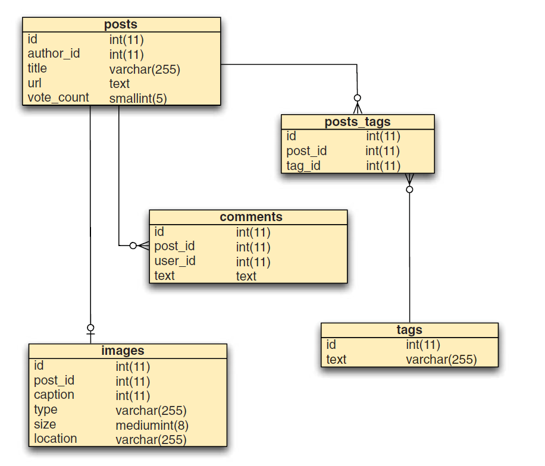

# Principais Características

Um banco de dados é definido em grande parte por seu modelo de dados. Nesta seção, veremos o modelo de dados do documento e veremos os recursos do MongoDB que nos permitem operar efetivamente nesse modelo. Também veremos as operações, concentrando-nos no mode da replicação do MongoDB e em sua estratégia de dimensionamento horizontal.

## O modelo de dados de documento (document data model)

```js
{
  _id: ObjectID("4bd9e8e17cefd644108961bb"),
  title: "Aventuras em Bancos de Dados",
  url: "http://exemplo.com/databases.txt",
  author: "msmith",
  vote_count: 20,
  tags: ["databases", "mongodb", "indexing"],
  image: {
    url: "http://example.com/db.jpg",
    caption: "",
    type: "jpg",
    size: 75381,
    data: "Binary"
  },
  comments: [
    { user: "bjones", text: "Artigo interessante!" },
    {
      user: "blogger",
      text: "Aqui tem outro artigo relacionado - http://example.com/db/db.txt"
    }
  ]
}
```

Este trecho mostra um documento que representa um artigo em um site de notícias sociais. Como você pode ver, um documento é essencialmente um conjunto de nomes de propriedades e seus valores. Os valores podem ser tipos de dados simples, como seqüências de caracteres, números e datas. Mas esses valores também podem ser matrizes e até mesmo outros documentos. Essas últimas construções permitem que os documentos representem uma variedade de estruturas de dados ricas. O documento de exemplo tem uma propriedade, tags, que armazena as tags do artigo em uma matriz. Mas ainda mais interessante é a propriedade de comentários, que faz referência a uma matriz de documentos de comentários. Vamos comparar isso com uma representação de banco de dados relacional padrão dos mesmos dados. A próxima figura mostra um provável análogia relacional. Como as tabelas são essencialmente planas, representar os diversos relacionamentos um-para-muitos em sua postagem exigirá várias tabelas. Você começa com uma tabela de posts contendo as principais informações de cada post. Então você cria três outras tabelas, cada uma das quais inclui um campo, post_id, referenciando a postagem original. A técnica de separar os dados de um objeto em várias tabelas, como essa, é conhecida como normalização. Um conjunto de dados normalizado, entre outras coisas, garante que cada unidade de dados seja representada em um único local. Mas a normalização estrita não é isenta de custos. Notavelmente, alguma montagem é necessária. Para exibir a postagem que acabamos de referenciar, você precisa realizar uma junção entre as tabelas de postagem e de tags. Você também precisará consultar separadamente os comentários ou possivelmente incluí-los em uma associação também. Em última análise, a questão de se a normalização estrita é necessária depende do tipo de dados que você está modelando. O que é importante notar aqui é que um modelo de dados orientado por documento representa naturalmente dados de forma agregada, permitindo que se trabalhe com um objeto holisticamente: todos os dados que representam uma postagem, de comentários a tags, podem ser ajustados em um único objeto de banco de dados.



Além de fornecer uma estrutura rica, os documentos não precisam estar em conformidade com um esquema pré-especificado. Com um banco de dados relacional, você armazena linhas em uma tabela. Cada tabela possui um esquema estritamente definido, especificando quais colunas e tipos são permitidos. Se alguma linha de uma tabela precisar de um campo extra, você terá que alterar a tabela explicitamente. O MongoDB agrupa documentos em coleções, contêineres que não impõem nenhum tipo de esquema. Em teoria, cada documento de uma coleção pode ter uma estrutura completamente diferente; na prática, os documentos de uma coleção serão relativamente uniformes. Por exemplo, todos os documentos da coleção de postagens terão campos para o título, tags, comentários e assim por diante. Mas essa falta de esquema imposto confere algumas vantagens. Primeiro, o código do seu aplicativo, e não o banco de dados, reforça a estrutura dos dados. Isso pode acelerar o desenvolvimento inicial do aplicativo quando o esquema está mudando com freqüência. Segundo, e mais significativamente, um modelo sem esquema permite representar dados com propriedades verdadeiramente variáveis. Por exemplo, imagine que você está criando um catálogo de produtos de comércio eletrônico. Não há como saber com antecedência quais atributos um produto terá, portanto, o aplicativo precisará levar em conta essa variabilidade.

## Consultas Ad Hoc

Dizer que um sistema é compatível com consultas ad hoc é dizer que não é necessário definir antecipadamente que tipos de consultas o sistema aceitará. Bancos de dados relacionais têm essa propriedade; eles executarão fielmente qualquer consulta SQL bem formada com qualquer número de condições. É fácil considerar as consultas ad hoc se os únicos bancos de dados que você já usou forem relacionais. Mas nem todos os bancos de dados suportam consultas dinâmicas. Por exemplo, os armazenamentos de chave-valor são consultáveis em apenas um eixo: a chave do valor. Como muitos outros sistemas, os armazenamentos de chave-valor sacrificam o poder de consulta rico em troca de um modelo de escalabilidade simples. Um dos objetivos do design do MongoDB é preservar a maior parte do poder de consulta que é tão fundamental para o mundo do banco de dados relacional. Para ver como funciona a linguagem de consulta do MongoDB, vamos dar um exemplo simples envolvendo postagens e comentários. Suponha que você queira encontrar todas as postagens marcadas com o termo política tendo mais de 10 votos. Uma consulta SQL ficaria assim:

```sql
SELECT * FROM posts
    INNER JOIN posts_tags ON posts.id = posts_tags.post_id
    INNER JOIN tags ON posts_tags.tag_id == tags.id
    WHERE tags.text = 'política' AND posts.vote_count > 10;
```

A consulta equivalente no MongoDB é especificada usando um documento como um correspondente. A chave especial `$gt` indica a condição maior que:

``` 
db.posts.find({'tags': 'politics', 'vote_count': {'$gt': 10}});
``` 

Observe que as duas consultas assumem um modelo de dados diferente. A consulta SQL depende de um modelo estritamente normalizado, em que as postagens e as tags são armazenadas em tabelas distintas, enquanto a consulta do MongoDB pressupõe que as tags sejam armazenadas em cada documento de postagem. Mas ambas as consultas demonstram a capacidade de consultar combinações arbitrárias de atributos, que é a essência da consulta ad hoc. Conforme mencionado anteriormente, alguns bancos de dados não oferecem suporte a consultas ad hoc porque o modelo de dados é muito simples. Por exemplo, você pode consultar um armazenamento de chave-valor somente por chave primária. Os valores apontados por essas chaves são opacos no que se refere às consultas. A única maneira de consultar por um atributo secundário, como a contagem de votos deste exemplo, é escrever código personalizado para criar manualmente entradas onde a chave primária indica uma determinada contagem de votos e o valor armazena uma lista das chaves primárias dos documentos que contêm a dita contagem de votos. Se você adotasse essa abordagem com um armazenamento de chave-valor, seria culpado de implementar um hack e, embora pudesse funcionar para conjuntos de dados menores, não seria recomendável inserir vários índices no que é fisicamente um único índice. Além disso, o índice baseado em hash em um armazenamento de chave-valor não suporta consultas de intervalo, o que provavelmente seria necessário para consultar um item como uma contagem de votos. Se você vem de um sistema de banco de dados relacional no qual as consultas ad hoc são a norma, basta observar que o MongoDB apresenta um nível de consulta semelhante. Se você estiver avaliando uma variedade de tecnologias de banco de dados, lembre-se de que nem todas essas tecnologias são compatíveis com consultas ad hoc e, se você precisar delas, o MongoDB pode ser uma boa escolha. Mas as consultas ad hoc sozinhas não são suficientes. Depois que o conjunto de dados aumentar para um determinado tamanho, os índices serão necessários para a eficiência da consulta. Índices apropriados aumentarão as velocidades de consulta e classificação em ordens de grandeza; consequentemente, qualquer sistema que suporte consultas ad hoc também deve suportar índices secundários.

## Índices Secundários

Índices secundários no MongoDB são implementados como árvores B. Os índices B-tree, também o padrão para a maioria dos bancos de dados relacionais, são otimizados para uma variedade de consultas, incluindo varreduras de intervalo e consultas com cláusulas de classificação. Ao permitir vários índices secundários, o MongoDB permite que os usuários otimizem uma ampla variedade de consultas.

## Replicação

O MongoDB fornece replicação de banco de dados por meio de uma topologia conhecida como um conjunto de réplicas. Os conjuntos de réplica distribuem dados entre as máquinas para redundância e automatizam o suporte a falhas no caso de interrupções no servidor e na rede. Além disso, a replicação é usada para dimensionar leituras de banco de dados. Se você tiver um aplicativo com leitura intensa, como é comum na web, é possível distribuir leituras de banco de dados em todas as máquinas no cluster de conjunto de réplicas. Conjuntos de réplicas consistem em exatamente um nó primário e um ou mais nós secundários. Como a replicação mestre-escravo com a qual você pode estar familiarizado com outros bancos de dados, o nó primário de um conjunto de réplicas pode aceitar leituras e gravações, mas os nós secundários são somente leitura. O que torna os conjuntos de réplicas exclusivos é seu suporte para falha automatizado: se o nó primário falhar, o cluster selecionará um nó secundário e o promoverá automaticamente para o primário. Quando a primária voltar a estar on-line, ela voltará a ser secundária.

## MongoDB Core e Ferramentas

O MongoDB é escrito em C++. O projeto é compilado em todos os principais sistemas operacionais. O MongoDB é open source e licenciado sob o GNU-AGPL. O código-fonte está disponível gratuitamente no GitHub e as contribuições da comunidade são frequentemente aceitas.

### O Servidor

O servidor de banco de dados é executado por meio de um executável chamado `mongod`. O processo do servidor `mongod` recebe comandos através de um soquete de rede usando um protocolo binário personalizado. Todos os arquivos de dados para um processo `mongod` são armazenados por padrão em `/data/db`. 

### O Console JavaScript

O console de comandos do MongoDB é uma ferramenta baseada em JavaScript para administrar o banco de dados e manipular dados. O executável `mongo` carrega o shell e se conecta a um processo `mongod` especificado. O shell tem muitos dos mesmos poderes que o shell MySQL, a principal diferença é que o SQL não é usado. Em vez disso, a maioria dos comandos é emitida usando expressões JavaScript. Por exemplo, você pode escolher seu banco de dados e inserir um documento simples na coleção de usuários da seguinte forma:

```
> use mongodb-in-action
> db.users.insert({name: "Kyle"})
```

O primeiro comando, indican qual banco de dados você deseja usar. O segundo comando é uma expressão JavaScript que insere um documento simples. Para ver os resultados da sua inserção, você pode emitir uma consulta simples:

```
> db.users.find()
{ _id: ObjectId("4ba667b0a90578631c9caea0"), name: "Kyle" }
```

O método `find` retorna o documento inserido, com o ID do objeto adicionado. Todos os documentos requerem uma chave primária armazenada no campo `_id`. Você pode inserir um `_id` personalizado, desde que possa garantir sua exclusividade. Mas se você omitir o `_id` completamente, então um ID do objeto MongoDB será inserido automaticamente. Além de permitir que você insira e consulte dados, o shell também permite que você execute comandos administrativos.

### Ferramentas de Linhas de Comando

O MongoDB é fornecido com vários utilitários de linha de comando:

- `mongodump` e `mongorestore` - utilitários padrão para fazer backup e restaurar um banco de dados;
- `mongoexport` e `mongoimport` - Esses utilitários exportam e importam dados JSON, CSV e TSV;
- `mongosniff` - Uma ferramenta de trace para operações e visualização de dados enviados para o banco de dados;
- `mongostat` - Pesquisa constantemente o MongoDB e o sistema para fornecer estatísticas úteis, incluindo o número de operações por segundo (inserções, consultas, atualizações, exclusões e assim por diante), a quantidade de memória virtual alocada e o número de conexões com o servidor;

## Conclusão

Para resumir, o MongoDB é um sistema de gerenciamento de banco de dados baseado em documentos e código-fonte aberto. Projetado para os requisitos de dados e escalabilidade dos aplicativos de internet modernos, o MongoDB apresenta consultas dinâmicas e índices secundários; atualizações atômicas rápidas e agregações complexas; e suporte para replicação com failover e sharding automáticos para dimensionamento horizontal.
